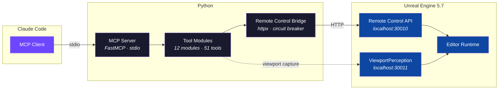
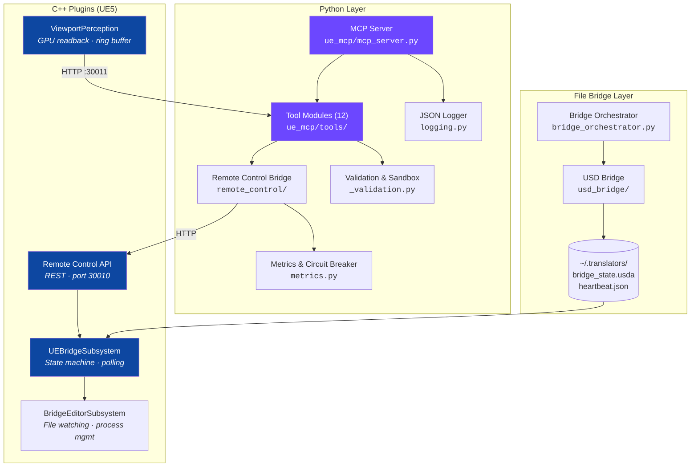

# UnrealEngine Bridge

**Give Claude Code full control of Unreal Engine 5.7.** Spawn actors, tweak materials, capture the viewport, keyframe animations — all through natural language via the [Model Context Protocol](https://modelcontextprotocol.io/).

51 MCP tools | 12 tool modules | 372 tests | Python 3.11+

---

## How It Works



---

## Quick Start

### Prerequisites

| Requirement | Version |
|---|---|
| Unreal Engine | 5.7 |
| Python | 3.11+ |
| Remote Control API plugin | Enabled in UE5 (ships with engine) |

### 1. Clone & Install

```bash
git clone https://github.com/JosephOIbrahim/UnrealEngine_Bridge.git
cd UnrealEngine_Bridge
pip install -e .
```

### 2. Open the UE5 Project

1. Open `UnrealEngine_Bridge.uproject` in Unreal Engine 5.7
2. Verify the **Remote Control API** plugin is enabled (Edit > Plugins)
3. Confirm `localhost:30010` is reachable (check Output Log for "Remote Control Web Server started")

### 3. Connect Claude Code

Add this to your Claude Code MCP configuration (`~/.claude/settings.json` or project `.mcp.json`):

```json
{
  "mcpServers": {
    "unreal": {
      "command": "python",
      "args": ["-m", "ue_mcp.mcp_server"],
      "cwd": "/path/to/UnrealEngine_Bridge"
    }
  }
}
```

### 4. Start Building

Open Claude Code and try:

> *"Spawn a cube at the origin, make it red, and rotate it 45 degrees"*

Claude will use `ue_spawn_actor`, `ue_create_material`, `ue_assign_material`, and `ue_set_transform` automatically.

---

## MCP Tools Reference

### Actors (6 tools)
| Tool | Description |
|---|---|
| `ue_spawn_actor` | Create an actor by class name with position/rotation |
| `ue_delete_actor` | Remove an actor from the level |
| `ue_list_actors` | List all level actors, optionally filtered by class |
| `ue_set_transform` | Set location, rotation, and/or scale |
| `ue_duplicate_actor` | Clone an actor with an offset |
| `ue_get_actor_bounds` | Get axis-aligned bounding box |

### Scene Understanding (4 tools)
| Tool | Description |
|---|---|
| `ue_get_actor_details` | Full inspection: class, transform, components, tags, parent |
| `ue_query_scene` | Multi-filter search (class, tag, name pattern, spatial proximity) |
| `ue_get_component_details` | Deep component info (mesh assets, materials, light properties) |
| `ue_get_actor_hierarchy` | Recursive parent-child attachment tree |

### Materials (4 tools)
| Tool | Description |
|---|---|
| `ue_create_material_instance` | Create a MaterialInstanceConstant from a parent material |
| `ue_set_material_parameter` | Set scalar, vector, or texture parameters |
| `ue_get_material_parameters` | List all exposed parameters with current values |
| `ue_assign_material` | Apply a material to a specific mesh slot |

### Blueprints (7 tools)
| Tool | Description |
|---|---|
| `ue_create_blueprint` | Create a new Blueprint asset |
| `ue_add_component` | Add a component to a live actor |
| `ue_set_component_property` | Set a property on a component |
| `ue_set_blueprint_defaults` | Override CDO default values |
| `ue_compile_blueprint` | Compile and save a Blueprint |
| `ue_get_actor_components` | List all components on an actor |
| `ue_spawn_blueprint` | Spawn a Blueprint instance into the level |

### Sequencer & Animation (4 tools)
| Tool | Description |
|---|---|
| `ue_create_level_sequence` | Create a new LevelSequence asset |
| `ue_play_sequence` | Play or scrub a sequence at a given time/rate |
| `ue_add_actor_to_sequence` | Bind a level actor to a sequence |
| `ue_add_keyframe` | Add a keyframe for a property at a given time |

### Perception (4 tools)
| Tool | Description |
|---|---|
| `ue_viewport_percept` | Capture the viewport with camera, selection, and scene metadata |
| `ue_viewport_watch` | Start/stop continuous viewport capture |
| `ue_viewport_config` | Configure capture resolution, format, and rate |
| `ue_viewport_diff` | Two-snapshot structural diff (actors, camera, selection changes) |

### Level (4 tools)
| Tool | Description |
|---|---|
| `ue_save_level` | Save the current level |
| `ue_get_level_info` | Get level name and actor count |
| `ue_load_level` | Load a level by content path |
| `ue_get_world_info` | Streaming levels, world settings, game mode |

### Assets (3 tools)
| Tool | Description |
|---|---|
| `ue_find_assets` | Search the Content Browser by pattern and class |
| `ue_create_material` | Create a material with BaseColor/Roughness/Metallic nodes |
| `ue_delete_asset` | Delete an asset from the Content Browser |

### Motion Graphics (3 tools)
| Tool | Description |
|---|---|
| `ue_create_cloner` | ClonerEffector procedural instancing |
| `ue_create_niagara_system` | Spawn a Niagara particle system |
| `ue_create_pcg_graph` | Create a PCG procedural generation volume |

### Editor Utilities (5 tools)
| Tool | Description |
|---|---|
| `ue_console_command` | Execute console commands with structured output parsing |
| `ue_undo` / `ue_redo` | Undo or redo the last editor transaction |
| `ue_focus_actor` | Focus the viewport camera on an actor |
| `ue_select_actors` | Set editor selection by label |

### Properties (2 tools)
| Tool | Description |
|---|---|
| `ue_get_property` | Read any UObject property by path |
| `ue_set_property` | Write any UObject property by path |

### Python Execution (1 tool)
| Tool | Description |
|---|---|
| `ue_execute_python` | Run arbitrary Python in the editor (AST-sandboxed) |

---

## Architecture



### Resilience

| Pattern | Detail |
|---|---|
| **Circuit breaker** | CLOSED → OPEN (5 failures) → HALF_OPEN (30s, 1 probe) → CLOSED |
| **Connection pooling** | 10 max connections, 5 keepalive |
| **Timeout** | 10s adaptive default |
| **Atomic file I/O** | `tempfile` + `os.replace` (NTFS-safe) |
| **Python sandbox** | AST-based validation blocking `os`, `subprocess`, `open`, `getattr`, dunders |

### Security

All Python code executed in UE5 is validated through a multi-layer sandbox:

- **Blocked modules**: `os`, `sys`, `subprocess`, `shutil`, `socket`, `pickle`, `importlib`, and 20+ more
- **Blocked builtins**: `exec`, `eval`, `open`, `getattr`, `globals`, `__import__`
- **Blocked attributes**: `system`, `popen`, `rmtree`, `kill`, plus dangerous dunders
- **Path validation**: Content path traversal (`..`) prevention on all inputs
- **Console safety**: Blocked commands (`exit`, `quit`, `crash`) and newline injection prevention

---

## Project Structure

```
UnrealEngine_Bridge/
├── ue_mcp/                        # MCP server package
│   ├── mcp_server.py              # FastMCP entry point (stdio)
│   ├── metrics.py                 # Telemetry + observability
│   ├── logging.py                 # Structured JSON logging
│   └── tools/                     # 12 tool modules (51 tools)
│       ├── actors.py              # Spawn, delete, list, transform
│       ├── scene.py               # Query, details, hierarchy
│       ├── materials.py           # Create, set params, assign
│       ├── blueprints.py          # Create, compile, components
│       ├── sequencer.py           # Animation / Level Sequence
│       ├── perception.py          # Viewport capture + diff
│       ├── editor.py              # Console, undo/redo, focus
│       ├── level.py               # Save, load, world info
│       ├── assets.py              # Find, create, delete
│       ├── mograph.py             # Cloner, Niagara, PCG
│       ├── properties.py          # Get/set UObject properties
│       ├── python_exec.py         # Sandboxed Python execution
│       ├── _validation.py         # Input sanitization + AST sandbox
│       ├── _codegen.py            # Shared code generation snippets
│       ├── _console_parsers.py    # Structured stat output parsers
│       └── _types.py              # Protocol types
│
├── remote_control/                # UE5 HTTP bridge package
│   ├── circuit_breaker.py         # CLOSED/OPEN/HALF_OPEN state machine
│   ├── async_client.py            # AsyncUnrealRemoteControl (MCP)
│   ├── sync_client.py             # UnrealRemoteControl (standalone)
│   ├── codegen.py                 # UE5 Python script generation
│   ├── execution.py               # File-based result polling
│   └── constants.py               # URLs, timeouts, pool config
│
├── usd_bridge/                    # USD file I/O package
│   ├── io.py                      # Atomic writes, locking, paths
│   ├── question.py                # Question read/write
│   ├── transition.py              # State transitions, finales
│   ├── signals.py                 # Behavioral signal extraction
│   ├── profile.py                 # Cognitive profiling + checksums
│   └── validation.py              # Bridge state validation
│
├── Plugins/
│   ├── UEBridge/                  # Core bridge C++ plugin
│   │   ├── UEBridgeRuntime/       # Subsystem, types, UI, style
│   │   └── UEBridgeEditor/        # File watching, process management
│   └── ViewportPerception/        # GPU readback, ring buffer, HTTP endpoint
│
├── bridge_orchestrator.py         # Game flow orchestration
├── remote_control_bridge.py       # Backward-compat shim → remote_control/
├── usd_bridge.py                  # Backward-compat shim → usd_bridge/
├── tests/                         # 372 tests (pytest)
├── pyproject.toml                 # Build config, dependencies, tooling
└── .github/workflows/ci.yml       # CI: Python 3.11/3.12, coverage, lint
```

---

## Development

### Running Tests

```bash
pip install -e ".[dev]"
python -m pytest tests/ -v
```

### Running with Coverage

```bash
python -m pytest tests/ --cov=ue_mcp --cov=remote_control --cov-report=term-missing
```

### Linting

```bash
pip install ruff
ruff check ue_mcp/ remote_control/ tests/
```

### Adding a New Tool

1. Create `ue_mcp/tools/your_module.py`
2. Define a `register(server: MCPServer, ue: UEBridge) -> None` function
3. Use `@server.tool()` decorators inside `register()`
4. Validate inputs with sanitizers from `_validation.py`
5. Register in `ue_mcp/tools/__init__.py`
6. Add tests in `tests/`

---

## License

Released under the [MIT License](LICENSE) — Copyright (c) 2026 Joseph Ibrahim.
