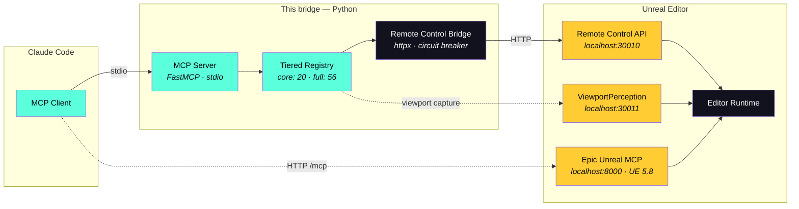
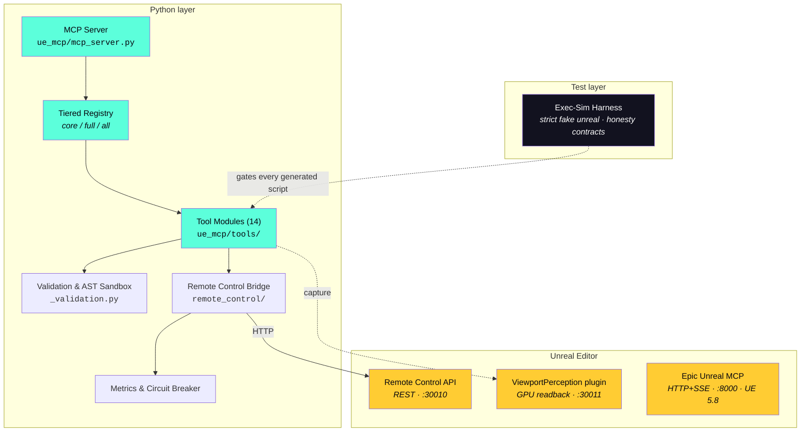

# UnrealEngine Bridge

[](https://github.com/JosephOIbrahim/UnrealEngine_Bridge/releases/latest)
[](https://github.com/JosephOIbrahim/UnrealEngine_Bridge/actions/workflows/ci.yml)
[](LICENSE)
[](https://www.unrealengine.com/)
[](https://www.python.org/)

**Claude Code, working inside your Unreal editor.** This bridge gives Claude the abilities Epic's own MCP doesn't ship: run real editor Python, see the viewport continuously, light scenes with one command, reason about space with surface normals, and stay honest about every result.

**58 MCP tools · 20 mounted by default · 635 tests** · [Changelog](CHANGELOG.md) · [Security](SECURITY.md)

---

## The one-paragraph story

UE 5.8 ships Epic's official **Unreal MCP** — 830 tools once you enable `AllToolsets`. That's the commodity control plane: spawn, transform, materials, Blueprints, Sequencer. **So this bridge stopped competing and specialized.** We live-probed Epic's entire surface, wrote the verdict for every one of our tools into [EPIC_MCP_MATRIX.md](docs/EPIC_MCP_MATRIX.md), and flipped the default: you get our **differentiated core** out of the box, Epic handles the basics, and the 36 overlapping tools stay one env var away.

---

## How it works

Two MCP servers, one editor. Claude uses both.



**Who does what:**

| Job | Server |
|---|---|
| Spawn / transform / materials / Blueprints / Sequencer | **Epic's MCP** (UE 5.8, `AllToolsets`) |
| Editor Python, console, lighting moods, cloner, perception, spatial reasoning | **This bridge** |
| Works on UE 5.7 (no Epic MCP there) | **This bridge**, with `UE_MCP_PROFILE=full` |

---

## Quick start

**You need:** UE 5.7 or 5.8 · Python 3.11+ · the Remote Control API plugin enabled (ships with the engine).

**1 — Install**

```bash
git clone https://github.com/JosephOIbrahim/UnrealEngine_Bridge.git
cd UnrealEngine_Bridge
pip install -e .
```

**2 — Open the project**

Open `UnrealEngine_Bridge.uproject`. Check the Output Log for *"Remote Control Web Server started"* — that's `localhost:30010` up.

On **UE 5.8**, the `ModelContextProtocol` and `AllToolsets` plugins self-enable (they're staged `Optional` in the project). Start Epic's server from the console: `ModelContextProtocol.StartServer`.

**3 — Connect Claude Code**

The repo ships a ready [`.mcp.json`](.mcp.json) — open the repo folder in Claude Code and both servers are configured. For other projects, copy it and fix the path.

**4 — Try it**

> *"Set golden hour and snap the crates to the terrain."*

Claude uses `ue_apply_mood_preset` and `ue_snap_to_ground` — two things no other UE MCP can do.

**Want the commodity tools from this bridge instead of Epic's?** Set the env var and restart the server:

```json
"unreal": { "command": "python", "args": ["-m", "ue_mcp.mcp_server"], "env": { "UE_MCP_PROFILE": "full" } }
```

---

## What's mounted by default (the core 20)

These are the tools Epic's MCP does **not** have — verified against all 830 of theirs ([the matrix](docs/EPIC_MCP_MATRIX.md)).

### 🐍 Editor Python & console (2)
| Tool | What it does |
|---|---|
| `ue_execute_python` | **The escape hatch.** Run real Python in the editor with the full `unreal` API (AST-sandboxed). Epic's `execute_tool_script` can't even `import unreal`. |
| `ue_console_command` | Run console commands with structured output parsing. No console exec exists anywhere in Epic's surface. |

### 👁 Perception (4)
| Tool | What it does |
|---|---|
| `ue_viewport_percept` | One frame + camera, selection, and scene metadata in a single call |
| `ue_viewport_watch` | Continuous capture at a set rate — Claude keeps watching |
| `ue_viewport_diff` | Two-snapshot structural diff: what moved, appeared, disappeared |
| `ue_viewport_config` | Resolution / format / rate for the capture pipeline |

### 🌅 Lighting & atmosphere (5)
| Tool | What it does |
|---|---|
| `ue_apply_mood_preset` | One command = coordinated sun + fog + clouds + color grade |
| `ue_blend_mood_presets` | Interpolate two moods (t 0→1) for in-between looks |
| `ue_set_time_of_day` | Hour 0–24 → sun elevation, azimuth, color, intensity |
| `ue_setup_sky_atmosphere` | Build or update the whole sky rig, idempotently |
| `ue_list_mood_presets` | See the built-in cinematic presets |

### 📐 Spatial reasoning (4)
| Tool | What it does |
|---|---|
| `ue_ground_trace` | Trace down at (x, y): hit point, **surface normal**, distance, actor. Epic's `trace_world` returns a bare distance. |
| `ue_snap_to_ground` | Drop an actor onto the surface, optionally tilting to the slope |
| `ue_spatial_query` | Nearest-N, AABB overlap, combined bounds, box contents |
| `ue_get_actor_hierarchy` | The full recursive attachment tree in one call |

### 🧩 Scene gaps Epic left open (3)
| Tool | What it does |
|---|---|
| `ue_duplicate_actor` | Clone a level actor with an offset (no Epic equivalent) |
| `ue_get_world_info` | Streaming levels, world settings, game mode |
| `ue_create_cloner` | ClonerEffector procedural instancing, with read-back-verified configuration |

### ❤️ Bridge health (2)
| Tool | What it does |
|---|---|
| `ue_status` | Is the editor up? Is Remote Control reachable? |
| `ue_health_check` | Version, uptime, circuit breaker, per-call metrics, active tool profile, **Epic MCP reachability** |

---

## The commodity tier (36 tools, `UE_MCP_PROFILE=full`)

Epic's MCP covers these — the matrix cites the exact equivalent for every row. They stay in the codebase, tested and honest, for UE 5.7 or as a fallback:

| Module | Tools |
|---|---|
| Actors | spawn · delete · list · set_transform · get_bounds |
| Scene | actor details · scene query · component details |
| Blueprints | create · add component · set properties · CDO defaults · compile · list components · spawn |
| Materials | create instance · set / get parameters · assign to slot |
| Sequencer | create sequence · play/scrub · bind actor · keyframe |
| Level | save · info · load |
| Assets | find · create material · delete |
| Mograph | Niagara system · PCG graph |
| Properties | get / set any UObject property |
| Editor | focus actor · select actors |
| Spatial | measure (distance / extent) |

**Experimental tier** (`UE_MCP_PROFILE=all`): `ue_undo` / `ue_redo` — honest not-implemented slots. The UE Python API has no scriptable editor-transaction route; these say so instead of pretending.

---

## 🧊 UE ↔ X3D round-trip harness  *(new in v0.3.0)*

**Hand Claude a level as open X3D it can read, edit, and validate — then write it back losslessly.** A thin, fully-tested slice: no live editor needed to prove an edit is safe.

**The one invariant it defends:**

```
deserialize( serialize( level ) )  ==  level
```

Lossless round trip, plus malformed edits rejected **on paper** before any mutation. If both hold, the bridge is trustworthy — if either fails, nothing else matters.

| Piece | Job |
|---|---|
| **Coordinate crux** | UE (Z-up, LH, cm) ↔ X3D (Y-up, RH, m) as one orthonormal basis `B` (det −1). `B⁻¹ = Bᵀ`, so the round trip is exact *by construction* — picking the right `B` is calibration, not correctness. |
| **Closed grammar** | An X3D node set small enough to hand a model *whole* and validate against. UE specifics (mesh · mobility · folder · parent) ride in `Metadata*`. |
| **Validate boundary** | Out-of-grammar nodes, dangling `USE`, NaN/∞, wrong arity, non-X3D root — all die here, before the editor is touched. |
| **Apply seam** | Diffs two scenes into typed ops (spawn · transform · material · reparent) that emit `ue_execute_python`. |
| **Preview** | The same X3D drops into a browser via X_ITE — free. |

```python
from x3d_bridge import Actor, serialize, deserialize, validate

x3d = serialize([Actor(guid="Rock_01", mesh="/Game/Meshes/SM_Rock",
                       t=(420.0, 0.0, 155.0))])
ok, errors = validate(x3d)     # the paper boundary
level = deserialize(x3d)       # lossless
```

**Status — honest, per the house rule:**

- ✅ **55 tests** — round-trip · validation battery · apply-op sequence — all green
- ✅ Basis `B` independently re-derived and confirmed three ways
- ⏳ `B` is *analytic* — **not yet calibrated against a live glTF export** (round-trip is basis-agnostic, so this is fidelity-only, never correctness)
- ⏳ A library today — **not yet exposed as MCP tools**

---

## Why trust the results? Honesty as architecture

This bridge's tools **cannot silently lie** — that's enforced, not promised:

- **Exec-simulated codegen tests.** Every generated editor script is compiled and executed against a strict fake `unreal` module in CI. Phantom APIs raise. Dropped arguments fail a sentinel gate. Hard-coded success prints fail honesty contracts.
- **Read-back verification.** Writes that UE can silently ignore (cloner layout names) are read back before being reported "applied".
- **Honest statuses.** The viewport fallback reports `capture_status: timeout` instead of an empty image with `success: true`. Not-implemented tools say "not implemented".
- **635 tests**, including scripted-failure contracts for every historical lying-tool bug.



### Resilience

| Pattern | Detail |
|---|---|
| **Circuit breaker** | CLOSED → OPEN (5 failures) → HALF_OPEN (30s, 1 probe) → CLOSED |
| **Connection pooling** | 10 max connections, 5 keepalive |
| **Timeout** | 10s adaptive default |
| **Atomic file I/O** | `tempfile` + `os.replace` (NTFS-safe) |
| **Python sandbox** | AST validation blocking `os`, `subprocess`, `open`, `getattr`, dunders |

### Network surface & trust model

Everything is **localhost, single trusted operator**: Remote Control (`:30010`), ViewportPerception (`:30011`, **off by default**), and — on 5.8 — Epic's MCP (`:8000`, no auth, serial on the game thread; Epic's EULA §6(e) governs what your LLM provider may do with transmitted data). Don't expose any of them to untrusted networks.

Full trust model and hardening guidance: **[SECURITY.md](SECURITY.md)**.

---

## Project structure

```
UnrealEngine_Bridge/
├── ue_mcp/                        # MCP server package
│   ├── mcp_server.py              # FastMCP entry point (stdio) + health tools
│   ├── metrics.py                 # Telemetry + observability
│   ├── ue_logging.py              # Structured JSON logging
│   └── tools/                     # 14 modules · 56 tools · tiered registry in __init__.py
├── remote_control/                # UE5 HTTP bridge (circuit breaker, codegen, polling)
├── x3d_bridge/                    # UE↔X3D round-trip harness (coords · grammar · validate · apply)
├── usd_bridge/                    # USD file I/O package (parked, out of the ship path)
├── Plugins/
│   ├── UEBridge/                  # Editor panel, file watcher (C++)
│   └── ViewportPerception/        # GPU readback + HTTP endpoint (C++)
├── docs/
│   ├── EPIC_MCP_MATRIX.md         # Retirement contract-of-record (probe-grounded)
│   └── epic_mcp/                  # Raw probe captures of Epic's 830-tool surface
├── scripts/probe_epic_mcp.py      # Re-probe Epic's surface per engine version
├── tests/                         # 635 tests, incl. tests/exec_sim/ + tier gates
├── smoke_live.py                  # Live-editor smoke harness (on-demand)
└── .mcp.json                      # Two-server config: this bridge + Epic's MCP
```

---

## Development

**Run the tests**

```bash
pip install -e ".[dev]"
python -m pytest -q                # 635 tests
```

**Lint**

```bash
ruff check ue_mcp/ remote_control/ tests/
```

**Add a tool** (each step is checked by CI)

1. Create `ue_mcp/tools/your_module.py` with a `register(server, ue)` function
2. Decorate tools with `@server.tool(...)`; validate inputs via `_validation.py`
3. Wire the module into `ue_mcp/tools/__init__.py` — **and classify the tool in `TIERS`** (an unclassified tool fails CI)
4. Add a sentinel entry in `tests/exec_sim/registry.py` (a missing entry fails CI)
5. Add tests

---

## License

Released under the [MIT License](LICENSE) — Copyright (c) 2026 Joseph Ibrahim.
